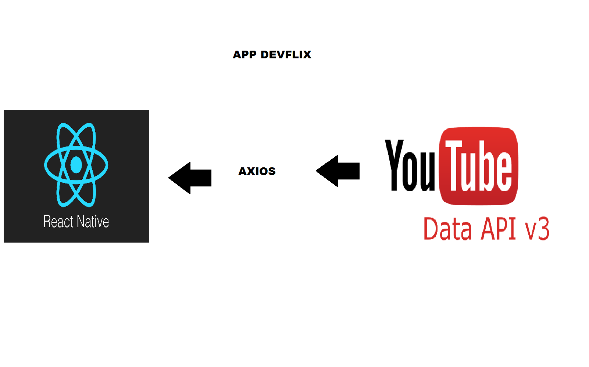

# Devflix

| App de streaming de vídeo estilo Netflix.

**Objetivo**
| Criar um app para visualização de vídeos ligados à Desenvolvimento de sistemas. Os vídeos estarão categorizados por disciplinas dos cursos de TI do SENAI.
**Justificativa**
| Esse projeto faz parte de uma atividade avaliativa da disciplina de Desenvolvimento de Sistemas para dispositivos móveis, do curso de Desenvolvimento de Sistemas do SENAI.

**Tecnologias**
- React Native
- JavaScript
**Frameworks**
- Expo
- npm
- Axios

**APIs**
- [YouTube](https://www.googleapis.com/youtube/v3)

Arquitetura

APP Utilizado foi o Node
Utiliza o Axio como ponte entre o APP e back
O Axio tambem faz a conexao com o youtube para demonstracao correta dos videos.

**Comandos**

- Instalar o Expo-cli:
  npm install -g expo-cli

- Inicializar uma aplicação
  expo init name_project

- Instalar dependências
  npm install

- Start na aplicação
  npm start
